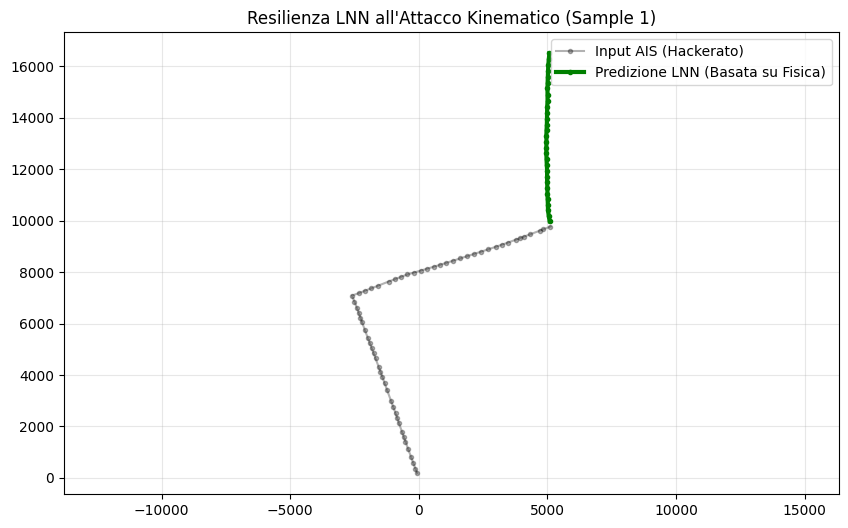
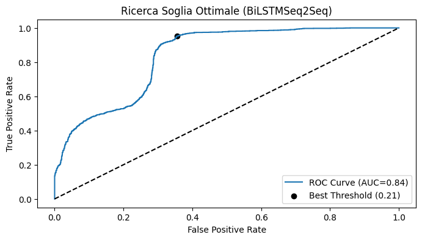
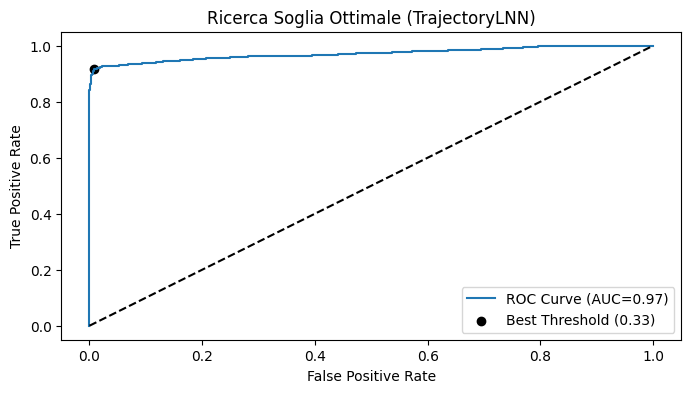

# 🚢 Maritime Trajectory Prediction & Anomaly Detection

> **A Comparative Study of LSTM and Liquid Neural Networks (LNN) for AIS Security**

## 📌 Project Overview

The Automatic Identification System (AIS) is the backbone of global maritime safety, yet it remains vulnerable to cyber-attacks such as **GPS Spoofing** and signal manipulation.
This project addresses the challenge of securing maritime navigation by developing a robust **Trajectory Prediction and Anomaly Detection** framework.

The core objective is to evaluate and compare two distinct Deep Learning paradigms for modeling vessel dynamics:
1.  **Discrete-Time Modeling:** Using Bi-Directional **LSTMs** (Long Short-Term Memory).
2.  **Continuous-Time Modeling:** Using **Liquid Neural Networks (LNNs)** based on Neural ODEs.

We benchmark these architectures on their ability to predict future positions and, crucially, to detect physics-violating anomalies in real-time.

---

## 🎯 Key Objectives

* **Trajectory Forecasting:** Predict the future path (30-min horizon) of a vessel based on its kinematic history.
* **Physics-Informed Analysis:** Integrate physical constraints (inertia, velocity consistency) into the learning pipeline.
* **Threat Modeling:** Simulate realistic cyber-attacks (Drift and Impossible Turns) to test system resilience.
* **Comparative Benchmark:** Quantify the trade-offs between standard RNNs and Liquid Networks in terms of accuracy and operational reliability (False Alarm Rate).

---

## ⚔️ The Models

### 1. Bi-LSTM Seq2Seq (The Baseline)
A standard Sequence-to-Sequence architecture employing Bidirectional LSTMs. It treats the vessel trajectory as a discrete sequence of steps.
* **Pros:** Established standard, good at pattern matching.
* **Cons:** Struggles with irregular sampling, lacks inherent understanding of physical continuity.

### 2. Liquid Neural Network (The Challenger)
A continuous-time architecture using **Liquid Time-Constant (LTC)** cells. It models the hidden state evolution via Ordinary Differential Equations (ODEs).
* **Pros:** Adapts to irregular time steps.
* **Cons:** Slightly higher training complexity.

---

## 🛡️ Threat Model: Generated Anomalies

To validate the security capabilities, we injected synthetic attacks into real AIS data from the Gulf of Mexico:

| Attack Type | Description | Violation |
| :--- | :--- | :--- |
| **Silent Drift** | Cumulative position bias (e.g., 5km over 30 min) simulating subtle GPS spoofing. | **Global Consistency:** The vessel moves faster/slower than the physics suggests over time. |
| **Kinematic Turn** | Instantaneous 90° orthogonal rotation of the velocity vector. | **Inertial Physics:** Large vessels cannot turn instantaneously without deceleration. |

---

## 📊 Results & Comparative Analysis

The experiments yielded clear insights into the strengths and weaknesses of each approach. While both models learned the general motion patterns, the **LNN demonstrated superior reliability** for security applications.

### 1. Trajectory Prediction (Clean Data)
*Metric: Average Displacement Error (ADE) over 30 minutes.*

| Model | ADE (meters) | FDE (meters) | Outcome |
| :--- | :---: | :---: | :--- |
| **Bi-LSTM** | 215.21 | 219.92 | Good Baseline |
| **LNN** | **134.13** | **166.89** | **37% More Accurate** |

### 2. Anomaly Detection (Security)
*Metric: Ability to distinguish between normal navigation and attacks.*

| Metric | Bi-LSTM | LNN | Interpretation |
| :--- | :---: | :---: | :--- |
| **ROC AUC** | 0.84 | **0.97** | LNN offers near-perfect separation. |
| **Detection Rate (Drift)** | **96.9%** | 84.6% | LSTM is more sensitive to small drifts... |
| **False Alarm Rate (FAR)** | 🔴 **35.5%** | 🟢 **3.4%** | ...but LSTM is unusable due to extreme false alarms. |

> **Conclusion:** The Bi-LSTM is "hypersensitive," flagging 1 out of 3 healthy vessels as attackers. The **LNN** acts as a robust physical filter, maintaining a low False Alarm Rate (3.4%) while successfully detecting significant anomalies.

---

## 🖼️ Visualizations

### Self-Correction Mechanism (LNN)
The image below shows the LNN (Green) refusing to follow a spoofed "Kinematic Turn" (Grey), adhering instead to the physical laws of motion.

### ROC Curve Comparison
The LNN (Right) shows a steeper ascent, indicating better classification performance.

  
   

